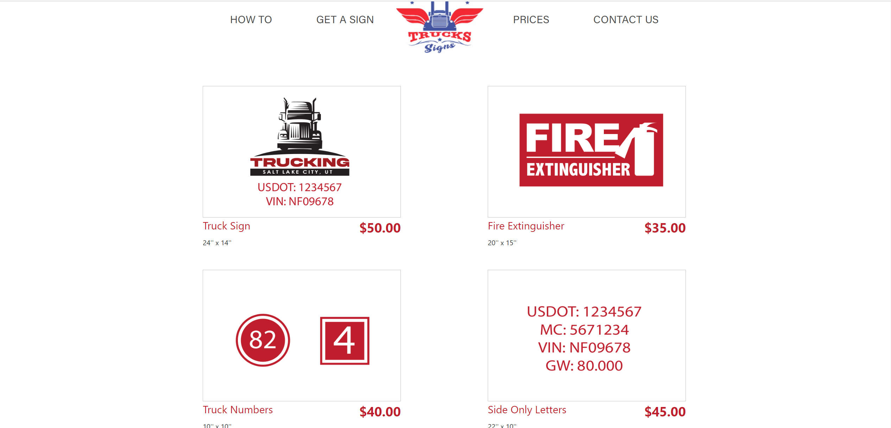
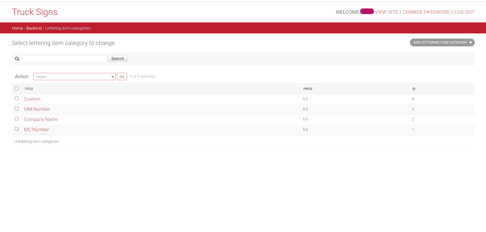
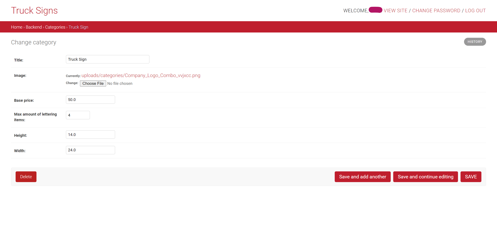

# Signs for Trucks NEXTJS  Frontend 

## Table of Contents

1. [Brief Introduction and Basic Workflow of the Website](#frontend)
1. [Quick Installation for testing using Docker](#docker)
1. [Custom Installation](#installation)
1. [Screenshots of the Frontend Next js App](#screenshots_frontend)
1. [Screenshots of the Django Backend Admin Panel](#screenshots)
1. [Screenshots of the Original Frontend Design](#screenshots_original)

<a name="frontend"></a>
### Brief Introduction
__Signs for Trucks__ is an online store to buy pre-designed vinyls with custom lines of letters (often call truck letterings). The store also allows clients to upload their own designs and to customize them on the website as well. Aside from the vinyls that are the main product of the store, clients can also purchase simple lettering vinyls with no truck logo, a fire extinguisher vinyl, and/or a vinyl with only the truck unit number (or another number selected by the client).

### Basic Workflow of the Website

1. __Selecting a pre-designed vinyl or uploading one:__ In the principal view of the website the client can select one of the pre-designed vinyls available to edit, or the client can upload a png, jpg, ... photo to use as the template for the vinyl. After this the client is redirected to the edit-vinyl section.

2. __Editing the selected/uploaded vinyl:__ In this page the client selects what lines of lettering should be added to the selected/uploaded vinyl as well as the color of the lettering (note that the background of the vinyl will be the color of the physical truck). The client can also leave a comment about more specific/custom instructions, and should always provide an email to contact or send a pre-view of the product. After this the client is redirected to the make-payment section.

3. __Making a Payment:__ The payment is managed via [Stripe](https://stripe.com/). The client should provide the required information that will be processed in the backend (DJANGO API). Then, the vinyl is sent to production.

<a name="docker"></a>
### Quick Installation for testing using Docker

1. Clone the repo:

   ```bash
   git clone https://github.com/Ceci-Aguilera/truck_signs_frontend.git
   ```

1. Install Docker and Docker Compose

1. Configure the environment variables: Create an .env.local file inside the root folder and set up the following environment variables:

   ```text
    NEXT_PUBLIC_API_DOMAIN_NAME (The url of the backend, for example, https://backend_api.com/)
   ```

1. Run the command:

   ```bash
   docker-compose up --build
   ```

1. Congratulations =) !!! the app should be running in [localhost:3000](http://localhost:3000)


<a name="installation"></a>

### Custom Installation

1. Clone the repo:

   ```bash
   git clone https://github.com/Ceci-Aguilera/truck_signs_frontend.git
   ```

1. Install dependencies:
   ```bash
   npm install
   ```

1. Configure the environment variables: Create an .env.local file inside the root folder and set up the following environment variables:

   ```text
    NEXT_PUBLIC_API_DOMAIN_NAME (The url of the backend, for example, https://backend_api.com/)
   ```

1. Run the app

   ```bash
   npx next dev
   ```

1. Congratulations =) !!! the app should be running in [localhost:3000](http://localhost:3000)


<a name="screenshots_frontend"></a>

### Screenshots of the Frontend NEXT JS App

#### Mobile View

  

  

---
#### Desktop View


---


---



---

<a name="screenshots"></a>

### Screenshots of the Django Backend Admin Panel

#### Mobile View

   

---

#### Desktop View


---



---




---

<a name="screenshots_original"></a>

### Screenshots of the Original Frontend Design

__NOTE:__ Some of the components of the original design have been changed, such as banner images, logos, fonts, and color tones. The main difference from the original design and the final result is footer that was extended to show more information, aside from this change there should not by any other major difference between the original design and the final result.

